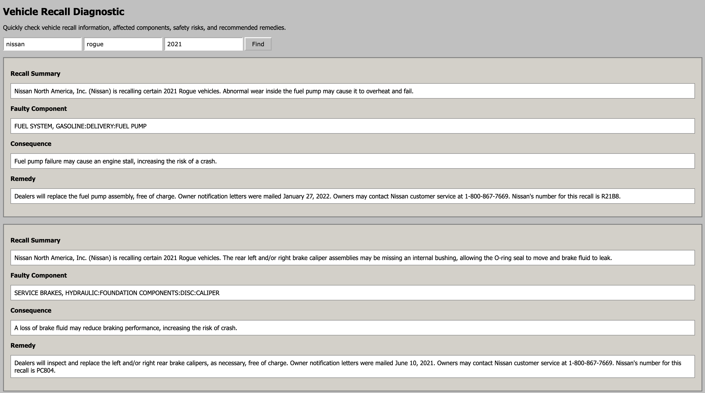

# Vehicle Recall Diagnostic

A simple vehicle recall tool application built using HTML, CSS, and JavaScript.

## About

This application allows users to search for vehicle recall information using the NHTSA API.
## Screenshot

## Built With

- HTML
- CSS
- JavaScript
- NHTSA API

## What I Practiced

- Fetching data from an API
- Working with JSON data
- DOM manipulation
- Handling user input
- Displaying API results on the page